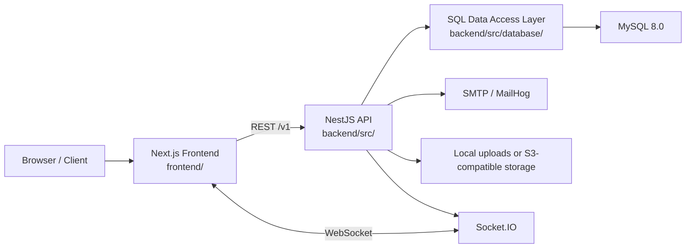
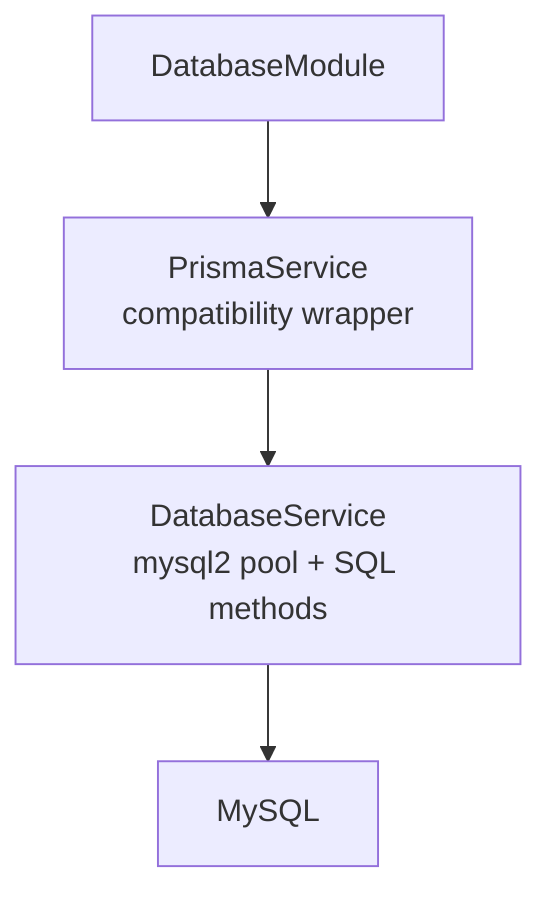
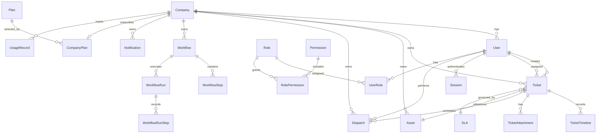
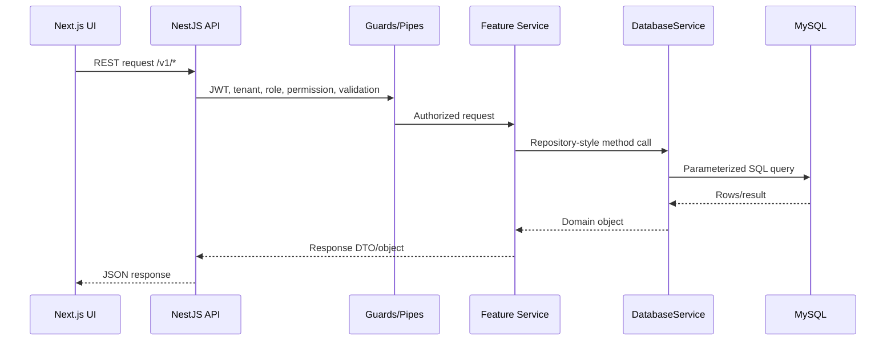

# FieldserviceIT Project Schema

This document describes the current project structure and runtime schema. The database target is SQL, specifically MySQL 8.0. The active backend data access layer is `backend/src/database/database.service.ts`, exposed through `PrismaService` for compatibility with existing service names.

## Runtime Topology

## Repository Layout

| Path | Purpose |
|------|---------|
| `README.md` | Project overview and quick start |
| `ARCHITECTURE.md` | System architecture notes |
| `LIFECYCLE.md` | Deployment and lifecycle guide |
| `docs/` | API, data model, infrastructure, and security docs |
| `backend/` | NestJS API server |
| `backend/src/main.ts` | API bootstrap, CORS, Helmet, validation, Swagger |
| `backend/src/app.module.ts` | Root backend module wiring |
| `backend/src/database/` | MySQL SQL service and global database provider |
| `backend/src/modules/` | Backend feature modules |
| `backend/schema.sql` | Reference MySQL schema for manual setup |
| `backend/prisma/` | Legacy schema/seed helpers, not the active source of truth |
| `frontend/` | Next.js app |
| `frontend/src/app/` | App Router pages and route groups |
| `frontend/src/components/` | Shared UI/layout components |
| `frontend/src/lib/` | API client, sockets, utilities |
| `frontend/src/stores/` | Zustand state |
| `infra/` | Docker Compose, Nginx, Kubernetes reference configs |

## Backend Module Schema

| Module | Main Responsibility |
|--------|---------------------|
| `AuthModule` | Login, registration, JWT, refresh sessions, password reset, email verification |
| `UsersModule` | Tenant-scoped user management and profile operations |
| `CompaniesModule` | Tenant/company records and company administration |
| `AdminModule` | Platform and tenant admin operations, roles, permissions, audit logs |
| `TicketsModule` | Ticket lifecycle, timeline, assignment, comments, exports, WebSocket events |
| `CmdbModule` | MDM-style device inventory, compliance status, enrollment state, and remote management actions |
| `FieldServiceModule` | Dispatch, technician work, field-service status updates |
| `WorkflowModule` | Workflow definitions and workflow runs |
| `NotificationsModule` | In-app notifications and email delivery |
| `ReportingModule` | Ticket, SLA, technician, asset, and trend reports |
| `RmmIntegrationModule` | RMM provider configuration and sync logic |
| `SettingsModule` | Tenant settings and branding |
| `SearchModule` | Cross-domain search |
| `UploadsModule` | Avatar, attachment, dispatch photo, and signature uploads |
| `BillingModule` | Plans, company plans, Stripe billing, usage counters |
| `HealthModule` | API/database health checks |

## Data Access Schema

The active database provider is global:

`DatabaseService` exposes repository-style properties used by backend services:

| Repository Property | SQL Table |
|---------------------|-----------|
| `user` | `User` |
| `company` | `Company` |
| `ticket` | `Ticket` |
| `ticketTimeline` | `TicketTimeline` |
| `ticketAttachment` | `TicketAttachment` |
| `asset` | `Asset` with MDM device fields for category, ownership, enrollment, compliance, security, telecom, and check-in state |
| `contract` | `Contract` |
| `sla` | `SLA` |
| `dispatch` | `Dispatch` |
| `notification` | `Notification` |
| `session` | `Session` |
| `role` | `Role` |
| `permission` | `Permission` |
| `userRole` | `UserRole` |
| `rolePermission` | `RolePermission` |
| `auditLog` | `AuditLog` |
| `workflow` | `Workflow` |
| `workflowRun` | `WorkflowRun` |
| `rmmProviderConfig` | `RmmProviderConfig` |
| `ticketTemplate` | `TicketTemplate` |
| `timeEntry` | `TimeEntry` |
| `kbArticle` | `KbArticle` |
| `plan` | `Plan` |
| `companyPlan` | `CompanyPlan` |
| `usageRecord` | `UsageRecord` |

## Core SQL Entity Relationships

## Frontend Route Schema

| Route Area | Path Pattern | Purpose |
|------------|--------------|---------|
| Public home | `/` | Landing/home entry |
| Auth | `/login`, `/register`, `/register-business`, `/forgot-password`, `/reset-password`, `/verify-email` | Public auth flows |
| Public ticketing | `/submit-ticket`, `/track` | Submit and track public tickets |
| App shell | `/(app)/layout.tsx` | Authenticated application layout |
| Dashboard | `/dashboard`, `/dashboards`, `/all`, `/favorites`, `/history` | Operational dashboards and grouped views |
| Tickets | `/tickets`, `/tickets/new`, `/tickets/[id]`, `/tickets/board`, `/my-tickets` | Ticket work queues and lifecycle |
| Assets | `/assets`, `/assets/new` | CMDB asset management |
| Dispatch | `/dispatch` | Field-service scheduling and status |
| Reports | `/reports` | Reporting and analytics |
| Search | `/search` | Cross-domain search |
| Billing | `/billing` | Plans, usage, subscription management |
| Integrations | `/integrations/rmm` | RMM provider setup |
| Settings/Profile | `/settings`, `/profile` | Tenant and user preferences |
| Admin | `/admin`, `/admin/users`, `/admin/company`, `/admin/companies`, `/admin/roles`, `/admin/permissions`, `/admin/audit-logs` | Tenant/platform administration |

## Request Flow

## Source Of Truth

| Concern | Source |
|---------|--------|
| Active database behavior | `backend/src/database/database.service.ts` |
| Reference SQL schema | `backend/schema.sql` |
| Backend module wiring | `backend/src/app.module.ts` and each `*.module.ts` |
| Frontend route map | `frontend/src/app/` |
| API client behavior | `frontend/src/lib/api.ts` |
| Local full-stack runtime | `infra/docker-compose.yml` |
